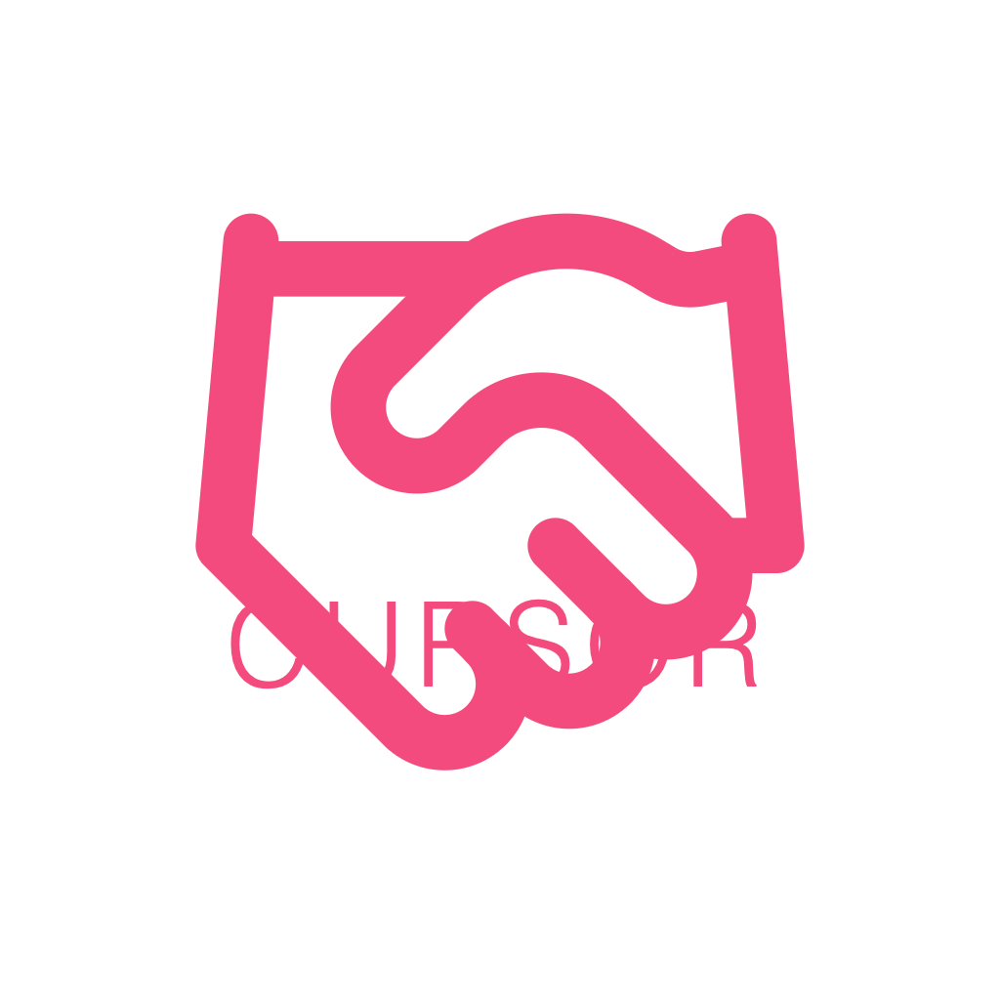

Cursor is a cross-platform AI coding agent written in C++.

It runs on macOS, Linux, and containerized environments. It performs codebase exploration, tool execution, and repository automation through a terminal interface.

## Changes

* Define Cursor as a cross-platform AI coding agent in C++.
* Clarify supported environments:

  * macOS with Homebrew-based setup
  * Linux via CI and system packages
  * Docker for reproducible execution
* Describe core capabilities:

  * Codebase exploration and search
  * File operations (read, write, edit)
  * Command execution (shell, git)
  * Build orchestration via CMake
* Present build workflows:

  * macOS build steps with Homebrew dependencies
  * Linux build steps using apt packages
  * Docker build and run commands

## Validation

* Verified macOS build using:

  * `xcode-select --install`
  * `brew install cpr nlohmann-json cmake`
  * `cmake .. && make`
* Verified Linux build via CI-compatible toolchain:

  * `nlohmann-json3-dev`, `libcurl4-openssl-dev`
* Verified Docker build and runtime execution
* Confirmed binary output at expected path (`build/bin/cursor-agent`)
* Confirmed cross-platform compilation consistency across macOS and Linux

## Platform

* macOS

  * Homebrew-based dependency setup
  * Native build support via CMake
* Linux

  * CI-based builds and system package support
  * Ubuntu toolchain compatibility
* Docker

  * Reproducible containerized builds
  * Isolated execution environment

## Features

* Codebase exploration

  * repository search
  * file inspection
* File operations

  * read/write/edit workflows
* Command execution

  * shell commands
  * git commands
* Build system support

  * CMake-based builds
  * cross-platform compilation
* Automation

  * workflow orchestration
  * tool integration

## Build

macOS:
xcode-select --install
brew install cpr nlohmann-json cmake

mkdir -p build
cd build
cmake ..
make

Linux:
sudo apt install nlohmann-json3-dev libcurl4-openssl-dev cmake

mkdir -p build
cd build
cmake ..
make

Docker:
docker build -t cursor .
docker run -it cursor

## Architecture

Cursor is a terminal-first agent that integrates system tools for development workflows. It is designed to be portable, minimal, and reproducible across environments.

## Support

## Contributing

Maintained by collaborators. External contributions not accepted. See `AGENTS.md` for workflow.
