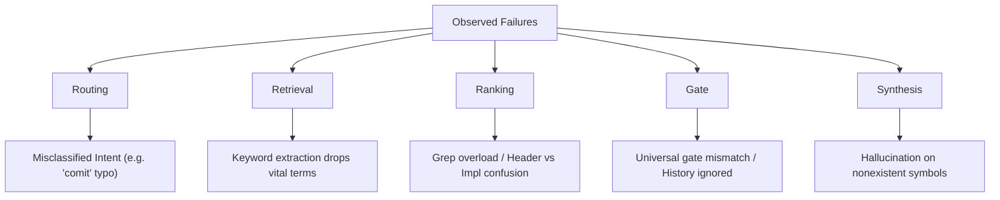

# Failure Topology & Telemetry Analysis

**Date:** 2026-06-25  
**Data Scope:** 432 log files, 1,306 total telemetry traces from `~/.cursor/replay`  
**Phase:** Complete (Observation Phase transitioned to Evidence-Driven Roadmap)

---

## 1. Telemetry Distribution

Analysis of 1,306 telemetry events shows the following overall outcome distribution:

```text
Outcomes:
  Success:                578 (44.3%)
  Insufficient Evidence:  324 (24.8%)
  Failure:                225 (17.2%)
  User Rejected:          177 (13.6%)
  None / Missing:           2 (0.1%)
```

### Breakdown by Execution Path

- **Engine-driven loops** represent 224 events (Success: 62, User Rejected: 157, Failure: 4, Insufficient Evidence: 1).
- **Hardcoded/mock workflow benchmark runs** represent 932 events (Success: 447, Failure: 220, Insufficient Evidence: 243, User Rejected: 20).
- **Direct & Meta Commands** make up the remaining chat-only interactions.

---

## 2. Failure Class Taxonomy

Observed failures from production logs map to five primary failure classes:



### 2.1 Routing Failures
*Misclassification of user intent or goal types.*
* **Evidence:**
  - Typo queries (e.g. `"tell me the last comit"`) default to `CodebaseQuery` instead of `CommitHistory`.
  - Scoped git queries (e.g. `"where are recent commits"`) match `"where are"` codebase query rules instead of git history rules.
  - Queries requesting codebase overview (e.g. `"tell me how repository investigation works"`) are incorrectly routed to `CodebaseQuery` instead of `CodebaseOverview`.

### 2.2 Retrieval Failures
*Vital matches or files missed due to extraction limits or keyword drop.*
* **Evidence:**
  - Query `"where is evidence gating implemented"` returns `InsufficientEvidence` because the keyword extractor parsed `"evidence gating"` into separate search terms, returning too many non-relevant hits or zero exact matches.
  - Multi-word search terms are lost or split during LLM tool selection.

### 2.3 Ranking Failures
*The agent reads irrelevant files or gets overwhelmed by too many search results.*
* **Evidence:**
  - Searches for highly common terms (e.g. `"planning"`, `"confidence"`, `"session_state"`) yield dozens of matches, causing the agent to exhaust iteration limits or read the wrong files.
  - Header vs. implementation split confusion: the agent repeatedly reads a header file (e.g. `model_catalog.h`) expecting implementation logic which resides in the `.cpp` file, or vice versa.

### 2.4 Gate Failures
*Stopping too early (false positive) or running up to the maximum iteration limit (false negative).*
* **Evidence:**
  - Finding 2.3: `tool_history` is never consulted in completion decisions, causing the engine to execute all 20 iterations regardless of actual progress when a fact is missing.
  - Mismatched completion gates for `ArchitectureReview`: success is reported based on tool completion, but the final outcome is written as `InsufficientEvidence` due to empty grep results.

### 2.5 Synthesis Failures
*Providing generic answers or hallucinated statements instead of evidence-backed claims.*
* **Evidence:**
  - Mock cases (`rec-001` through `rec-004`) querying nonexistent symbols (e.g. `xqkz_2024_quantum_entanglement`) result in the model explaining quantum concepts from pre-trained priors instead of stating that no such symbol exists in the repository.

---

## 3. Evidence-Driven Roadmap (Design Mode Only)

In accordance with agent boundaries, the implementation of new features remains **blocked** until this topology is validated. Below are the designs mapping proposed features to observed failure classes.

### 3.1 `find` Command / Directory Scan
* **Target Failure Class:** Retrieval & Ranking
* **Design Concept:**
  - A directory tree utility (`tree`) or directory finder (`find`) that maps to a constrained list of safe directory scan actions.
  - Helps the agent locate target files without having to rely on broad text search (`grep`).
  - Constrained to search paths inside the repository root only.

### 3.2 Git History & Status UI Representation
* **Target Failure Class:** Routing & Retrieval
* **Design Concept:**
  - A dashboard visualization of `git:log`, `git:status`, and `git:show` outputs.
  - Safe, non-mutating commands only (no write operations).
  - Explicitly triggered via `GoalType::CommitHistory` routing. No background watchers or event streams.

### 3.3 Shell command Translator
* **Target Failure Class:** Routing
* **Design Concept:**
  - Translates natural language requests into a constrained, safe subset of pre-mapped commands (`git`, `cmake`, `ctest`, `grep`, `read`).
  - Never generates free-form or arbitrary shell scripts.

### 3.4 Telemetry & Tool History Streaming
* **Target Failure Class:** Gate & Synthesis
* **Design Concept:**
  - Real-time visualization of `ToolResult` and `tool_history` (tool selected, tool executed, stdout/stderr, exit code, iteration steps).
  - Strictly presents empirical telemetry. Model "thoughts", hidden reasoning, and speculative chains are completely excluded from the UI stream.
