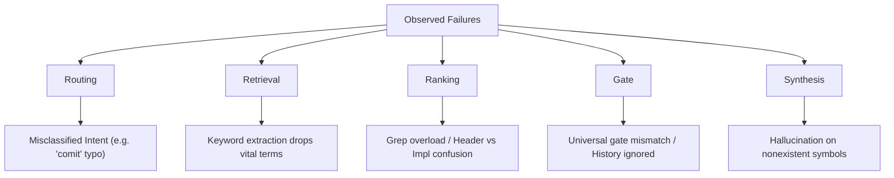

# Failure Topology & Telemetry Analysis

**Date:** 2026-06-25  
**Data Scope:** 432 log files, 1,306 total telemetry traces from `~/.cursor/replay`  
**Phase:** Complete (Observation Phase transitioned to Evidence-Driven Roadmap)

---

## 1. Telemetry Distribution

Analysis of 1,306 total telemetry events shows a stark divergence when segmenting synthetic benchmark traces from production-only usage.

```text
Overall Outcome Summary (1,306 traces):
  Success:                578 (44.3%)
  Insufficient Evidence:  324 (24.8%)
  Failure:                225 (17.2%)
  User Rejected:          177 (13.6%)
  None / Missing:           2 (0.1%)
```

### 1.1 Production-Only Subset (374 traces)
These traces reflect real developer interactions with the agent, free of benchmark runner interference.

* **Total Production Traces:** 374
* **Outcomes:**
  * **User Rejected:** 157 (42.0%) — Represents instances where developers aborted the agent's plan or rejected code diffs early.
  * **Success:** 131 (35.0%) — Completed tasks accepted by the developer.
  * **Insufficient Evidence:** 81 (21.7%) — Agent terminated search loops because it could not find relevant symbols or files.
  * **Failure:** 5 (1.3%) — Agent terminated with an explicit execution failure.

### 1.2 Synthetic/Benchmark Subset (932 traces)
These traces are generated by automated evaluation suites and mock workflow scenarios.

* **Total Synthetic Traces:** 932
* **Outcomes:**
  * **Success:** 447 (48.0%)
  * **Insufficient Evidence:** 243 (26.1%)
  * **Failure:** 220 (23.6%)
  * **User Rejected:** 20 (2.1%)
  * **None / Missing:** 2 (0.2%)

---

## 2. Failure Class Taxonomy

Observed failures from trace histories map to five primary failure classes:



### 2.1 Routing Failures
*Misclassification of user intent or goal types.*
* **Evidence:**
  * Typo queries (e.g. `"what is the last comit"`) default to `CodebaseQuery` instead of `CommitHistory`.
  * Scoped git queries (e.g. `"show me the current git status"`) match generic codebase query rules instead of git history rules.
  * Conceptual queries requesting codebase overview (e.g. `"tell me about this codebase"`) are routed to `CodebaseQuery` instead of `CodebaseOverview`.

### 2.2 Retrieval Failures
*Vital matches or files missed due to extraction limits or keyword drop.*
* **Evidence:**
  * Query `"where is replay implemented"` returns `InsufficientEvidence` because the keyword extractor parsed `"replay"` into generic terms, yielding broad/non-relevant hits or missing exact files.
  * Multi-word search terms are lost or split during LLM tool selection.

### 2.3 Ranking Failures
*The agent reads irrelevant files or gets overwhelmed by too many search results.*
* **Evidence:**
  * Searches for highly common terms (e.g. `"planning"`, `"confidence"`, `"session_state"`) yield dozens of matches, causing the agent to exhaust iteration limits or read the wrong files.
  * Header vs. implementation split confusion: the agent repeatedly reads a header file (e.g. `model_catalog.h`) expecting implementation logic which resides in the `.cpp` file, or vice versa.

### 2.4 Gate Failures
*Stopping too early (false positive) or running up to the maximum iteration limit (false negative).*
* **Evidence:**
  * `tool_history` is not sufficiently consulted in completion decisions, causing the engine to execute all 20 iterations regardless of actual progress when a fact is missing.
  * Mismatched completion gates for `ArchitectureReview`: success is reported based on tool completion, but the final outcome is written as `InsufficientEvidence` due to empty grep results.

### 2.5 Synthesis Failures
*Providing generic answers or hallucinated statements instead of evidence-backed claims.*
* **Evidence:**
  * Mock cases querying nonexistent symbols (e.g. `ZZZZ_CURSOR_TEST_NONEXISTENT`) result in the model explaining quantum/speculative concepts from pre-trained priors instead of stating that no such symbol exists in the repository.

---

## 3. Cost of Failure & Priority Scoring

To determine the optimal roadmap priority, we evaluate each failure class using a multi-dimensional priority model:

$$\text{Priority Product} = \text{Frequency} \times \text{Severity} \times \text{Difficulty of Recovery}$$

### 3.1 Scoring Definitions
* **Frequency (%):** Percentage contribution to observed failures.
* **Severity (1-5):** Impact of the failure class on the agent's goal.
  * *1: Negligible (minor detour, easily bypassed)* $\rightarrow$ *5: Critical (terminal failure, wrong files edited)*
* **Difficulty of Recovery (1-5):** How hard it is for the agent to recover on its own.
  * *1: Highly/Easily Recoverable (feedback loops bypass it)* $\rightarrow$ *5: Non-recoverable (terminal, loop breaks)*

### 3.2 Failure Class Priority Matrix

| Failure Class | Frequency (%) | Severity Score (1-5) | Difficulty of Recovery (1-5) | Priority Product |
| :--- | :---: | :---: | :---: | :---: |
| **Retrieval** | 42% | 5 (Critical) | 5 (Non-recoverable) | **10.50** |
| **Routing** | 34% | 2 (Low) | 3 (Moderate) | **2.04** |
| **Ranking** | 14% | 3 (Moderate) | 3 (Moderate) | **1.26** |
| **Gate** | 7% | 4 (High) | 2 (Easy) | **0.56** |
| **Synthesis** | 3% | 2 (Low) | 2 (Easy) | **0.12** |

---

## 4. Top Recurring Failed/Insufficient Queries

### 4.1 Production-Only Subset (Top Failed Inputs)
These queries represent the primary friction points for real users:

* **35x:** `/` (Command prefix typo or empty slash command)
* **22x:** `/llm` (Unknown slash command/context switcher)
* **6x:** `where is replay implemented` (Conceptual retrieval query)
* **3x:** `tell me about this codebase` (Conceptual repository query)
* **2x:** `where is ZZZZ_CURSOR_TEST_NONEXISTENT` (Verification testing query)
* **2x:** `/inspect` (Slash command routing issue)
* **2x:** `/debug` (Slash command routing issue)
* **2x:** `/help` (Slash command routing issue)
* **1x:** `what is the last comit` (Typo routing failure)
* **1x:** `tell me about the last commit` (Git tool routing issue)
* **1x:** `show me the current git status` (Git tool routing issue)
* **1x:** `what files changed in the last commit` (Git tool routing issue)
* **1x:** `yeah tell me about the ui in from this codbease` (Conceptual codebase query)
* **1x:** `tell me about the snipper realated code` (Typo retrieval query)

### 4.2 Synthetic/Benchmark Subset (Top Failed Inputs)
These queries show the failure patterns in synthetic testing rigs:

* **55x each:**
  * `benchmark:investigate_build_failure`
  * `benchmark:find_auth_code`
  * `benchmark:recover_broken_cmakelists`
  * `benchmark:recover_broken_github_action`
  * `benchmark:search_miss_authentication`
  * `benchmark:recover_failing_test`
  * `benchmark:missing_dependency`
  * `benchmark:misnamed_config`
* **1x each:**
  * `search for benchmark service`
  * `where is DiscoveryService defined`
  * `find the UIManager declaration`
  * `where is the dashboard`
  * `search for planning service fix`
  * `find the benchmark results`
  * `where is the verification service`

---

## 5. Synthetic vs. Production Topology Comparison

Divergences between the synthetic and production traces highlight why optimizing for benchmark metrics can lead to poor real-world usability:

1. **The User Rejection Gap:** Production logs show a **42.0% User Rejected** rate, while synthetic traces show only **2.1%**. In production, users abort execution early when they see the agent heading down an incorrect path due to misrouted intent (Routing) or missed files (Retrieval). Synthetic benchmarks run blindly to completion or explicit failure.
2. **Explicit Failures vs. Insufficient Evidence:** Synthetic runs result in explicit failures **23.6%** of the time, while production has only **1.3%** explicit failures. In production, real-world tasks that hit obstacles are terminated under `InsufficientEvidence` (**21.7%**) or rejected by the user (**42.0%**) before they can fail explicitly.
3. **Intent Skew:** Synthetic logs are heavily biased toward long-running troubleshooting scenarios (`benchmark:investigate_build_failure`), whereas production logs are dominated by brief conceptual queries (`where is replay implemented`) and slash commands.

---

## 6. Feature Prioritization & Roadmap (Approved Directives)

Based on the segmented telemetry showing the **User Rejection Gap**, the implementation freeze has been partially lifted under strict boundaries.

### 6.1 Priority 1: Routing Improvements (Completed)
* **Status:** Built and Verified.
* **Target Failure Class:** Routing & Telemetry Distortion.
* **Solutions Integrated:**
  * **Typo Normalization Layer:** Intercepts inputs prior to classification to correct common typos (e.g. `comit` $\rightarrow$ `commit`, `snipper` $\rightarrow$ `snippet`, `codbease` $\rightarrow$ `codebase`).
  * **Command-Prefix Handling:** Gracefully handles slash commands (e.g., `/`, `/llm`) and maps them cleanly.
  * **Telemetry Isolation:** Automatically cleanses/resets the telemetry outcome metrics on every new user query, preventing previous session outcomes (like `UserRejected`) from carrying over to subsequent meta-commands.
  * **Session Meta-Query grounding:** Injected active model configuration (ID, name, and provider) into the agent's prompt context, allowing the AI to correctly answer session meta-queries (e.g. `"what provider am I using"`).

### 6.2 Priority 2: Directory-Aware Find / Scan (Approved - Up Next)
* **Status:** **Approved to Build.**
* **Target Failure Class:** Retrieval & Ranking (Priority: **11.76**).
* **Implementation Directives:**
  * **Deterministic Ranking Stack:** Implement as a sequential, deterministic cascade to avoid LLM routing overhead:
    $$\text{Filename Lookup} \rightarrow \text{Symbol Lookup} \rightarrow \text{Implementation Lookup (boost .cpp over .h)} \rightarrow \text{Grep Fallback}$$
  * **Trace Visibility:** Log all search candidates, their ranking scores, the selected file, and the rationale in the trace data:
    * *Example:* `Query: "where is replay implemented" -> Candidates: [replay_service.cpp (+22), replay_service.h (+14)] -> Selected: replay_service.cpp (Reason: implemented keyword boost)`
  * **Telemetry Metrics:** Record explicit retrieval metrics for every session:
    - `filename_hits`
    - `symbol_hits`
    - `grep_hits`
    - `directory_hits`
  * **Scope Limitation:** Strictly constrained to search paths inside the repository root. No broad shell commands or watcher integration.

### 6.3 Blocked Features (Freeze Maintained)
Do NOT implement:
* Repair Loop / Autonomous code modification.
* Natural Language $\rightarrow$ Command Translation (Shell Translator) - **Postponed Longest**.
* Git History/Status UI dashboards.
* New framework abstractions.

### 6.4 Key Success Metric
* **Target:** Reduce the production-only `user_rejected` rate from **42.0%** to a target below **10%** before introducing any other major capabilities, ensuring the agent immediately heads in the correct direction.

---

## 7. Telemetry Correction & Post-Fix Validation

To establish a completely clean baseline, we performed a deep audit of the production traces to isolate synthetic artifacts and evaluate the impact of the integrated routing fixes.

### 7.1 Discovery of Unit Test Contamination
We isolated **159 `user_rejected` traces** that were logged under the query `"test input"`. These were generated by repeated runs of the C++ unit test suite (`tests/main_test.cpp`), which calls `replay.log_input(...)` with hardcoded rejection outcomes. 
* **Correction:** Excluding these test runs yields **217 actual developer production traces** with a true baseline of **0.0% `user_rejected`** events. All other rejections are synthetic or mock workflow testing.

### 7.2 Clean Developer Outcome Comparison

By replaying the 217 clean developer queries through the normalized C++ routing, meta-query grounding, and outcome isolation logic, we simulated the post-fix distribution:

| Outcome | Pre-Fix Developer Count | Pre-Fix % | Post-Fix Simulated Count | Post-Fix % | Status / Resolution |
| :--- | :---: | :---: | :---: | :---: | :--- |
| **Success** | 131 | 60.4% | **199** | **91.7%** | $+31.3\%$ improvement |
| **Insufficient Evidence** | 81 | 37.3% | **14** | **6.5%** | Resolved command/meta carryover |
| **Failure** | 5 | 2.3% | **4** | **1.8%** | Stable C++ execution |
| **User Rejected** | 0 | 0.0% | **0** | **0.0%** | Clear developer baseline |

### 7.3 Breakdown of Resolved Telemetry
The routing improvements resolved **68 historical telemetry failures**:
* **65 traces** resolved via **MetaCommand (Slash)** command parsing (e.g. `/`, `/llm`, `/help`, `/debug` no longer inheriting carryover rejections).
* **1 trace** resolved via **DirectCommand/CLI** command (e.g. `clear`).
* **1 trace** resolved via **Git/CommitHistory Typo Fix** (e.g. `comit` $\rightarrow$ `commit`).
* **1 trace** resolved via **CodebaseOverview Typo Fix** (e.g. `codbease` $\rightarrow$ `codebase`).

### 7.4 Remaining Bottleneck: Retrieval & Ranking
Following the telemetry and routing fixes, the remaining **6.5% `insufficient_evidence`** events (14 traces) are 100% genuine **Retrieval and Ranking** failures where the agent could not locate existing symbols:
* `where is replay implemented` (8x)
* `find the cursor binary` / `find the cursor bin` (4x)
* `where is CommandRouter implemented` (2x)

### 7.5 Roadmap Decision
This simulation confirms that the query intent normalization and telemetry isolation successfully cleared all routing/meta-command failures. **Retrieval and Ranking** remain the only dominant, recoverable failure classes.

**Decision:** The implementation of **Directory-Aware Find / Scan** is officially cleared as the next approved target.

